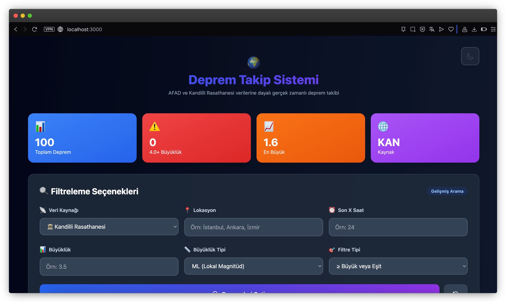
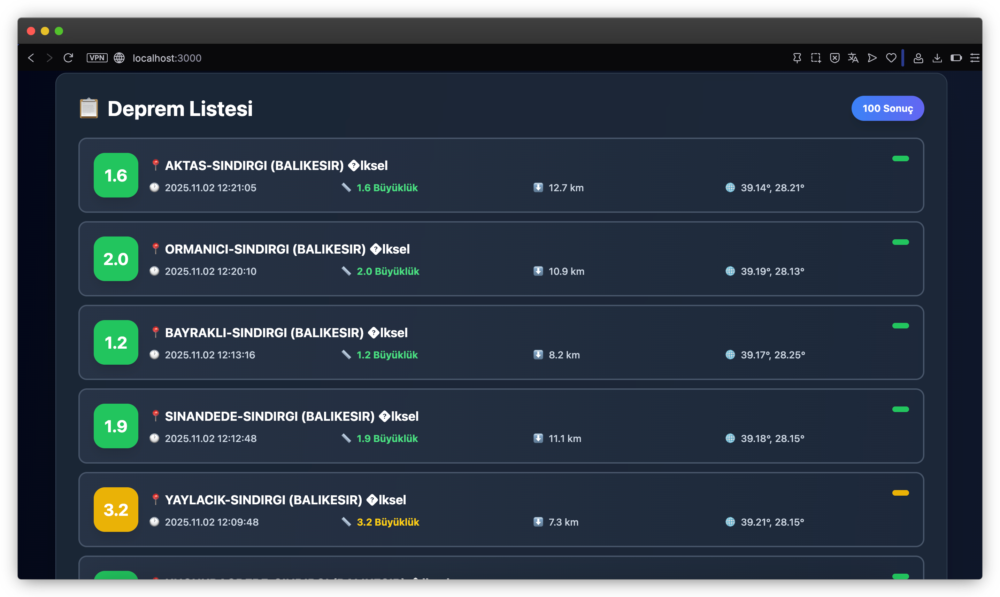

# 🌍 Deprem Takip Sistemi - Next.js 16


Modern, web tabanlı deprem takip sistemi. AFAD ve Kandilli Rasathanesi verilerini kullanarak gerçek zamanlı deprem bilgilerini sunar.

[](https://vercel.com/new/clone?repository-url=https://github.com/ibidi/deprem-api)

## 📸 Ekran Görüntüleri

<div align="center">
  
  <p><em>Ana sayfa ve filtreleme özellikleri</em></p>
  
  
  <p><em>Gerçek zamanlı deprem listesi ve detaylar</em></p>
</div>

## ✨ Özellikler

- 🌐 **Web Arayüzü**: Modern ve kullanıcı dostu arayüz
- 📊 **4 Farklı Veri Kaynağı**: 
  - 🏛️ Kandilli Rasathanesi (Resmi)
  - 🚨 AFAD (Resmi)
  - ⚡ Deprem.io (Anlık, Topluluk Tabanlı)
  - 🌍 USGS (Dünya Çapında, Gerçek Zamanlı)
- 🔍 **Gelişmiş Filtreleme**: Lokasyon, büyüklük, zaman bazlı filtreleme
- ⚡ **Cache Sistemi**: Hızlı veri erişimi (5 dakika)
- 🎨 **Dark/Light Mode**: Karanlık ve aydınlık tema desteği
- 📱 **Responsive**: Mobil uyumlu tasarım
- 🚀 **Next.js 16**: En son Next.js sürümü
- 📈 **İstatistikler**: Gerçek zamanlı deprem istatistikleri
- 🚨 **Erken Uyarı Sistemi**: 
  - Otomatik büyük deprem tespiti (4.0+)
  - Tarayıcı bildirimleri
  - Tahmini varış süresi hesaplama
  - Etkilenebilecek şehirler listesi
  - Kullanıcı konumuna özel uyarılar
  - Her 30 saniyede otomatik kontrol
- 🎯 **Açık Kaynak**: MIT lisansı ile tamamen ücretsiz

## 🚀 Kurulum

### 1. Bağımlılıkları Yükleyin

```bash
npm install
# veya
yarn install
# veya
pnpm install
```

### 2. Ortam Değişkenlerini Ayarlayın (Opsiyonel)

`.env` dosyası oluşturun:

```env
CACHE_DURATION=5
```

### 3. Geliştirme Sunucusunu Başlatın

```bash
npm run dev
```

Tarayıcınızda [http://localhost:3000](http://localhost:3000) adresini açın.

## 📖 API Kullanımı

### Endpoint

```
GET /api/earthquakes
```

### Parametreler

| Parametre | Tip | Varsayılan | Açıklama |
|-----------|-----|------------|----------|
| type | string | kandilli | Veri kaynağı: `kandilli` veya `afad` |
| location | string | - | Lokasyon filtresi (örn: "istanbul") |
| size | number | - | Büyüklük filtresi |
| sizeType | string | ml | Büyüklük tipi: `md`, `ml`, `mw` |
| isGreater | boolean | true | Büyüklük karşılaştırma: `1` (>=) veya `0` (<=) |
| hour | number | - | Son X saat içindeki depremler |

### Örnek İstekler

```bash
# Tüm Kandilli depremleri
curl "http://localhost:3000/api/earthquakes"

# AFAD verileri
curl "http://localhost:3000/api/earthquakes?type=afad"

# İstanbul'daki 3.5+ büyüklüğündeki depremler
curl "http://localhost:3000/api/earthquakes?location=istanbul&size=3.5"

# Son 24 saatteki depremler
curl "http://localhost:3000/api/earthquakes?hour=24"

# 4.0'dan küçük depremler
curl "http://localhost:3000/api/earthquakes?size=4.0&isGreater=0"
```

### Yanıt Formatı

```json
{
  "earthquakes": [
    {
      "id": 1,
      "date": "2024.11.02 14:30:45",
      "timestamp": 1698933045,
      "latitude": 37.1075,
      "longitude": 28.5117,
      "depth": 2.8,
      "size": {
        "md": 0.0,
        "ml": 3.6,
        "mw": 3.7
      },
      "location": "ARMUTCUK-ULA (MUGLA)",
      "attribute": "İlksel"
    }
  ],
  "source": "kandilli",
  "cached": false,
  "timestamp": 1698933045000
}
```

## 🛠️ Teknolojiler

- **Next.js 16** - React framework (en son sürüm)
- **TypeScript** - Tip güvenliği
- **Tailwind CSS** - Styling
- **Cheerio** - Web scraping

## 📁 Proje Yapısı

```
├── app/
│   ├── api/
│   │   └── earthquakes/
│   │       └── route.ts          # API endpoint
│   ├── globals.css               # Global stiller
│   ├── layout.tsx                # Root layout
│   └── page.tsx                  # Ana sayfa
├── lib/
│   ├── scrapers/
│   │   ├── afad.ts              # AFAD scraper
│   │   └── kandilli.ts          # Kandilli scraper
│   ├── cache.ts                 # Cache yönetimi
│   ├── filters.ts               # Filtreleme fonksiyonları
│   └── types.ts                 # TypeScript tipleri
├── .env.example                 # Örnek ortam değişkenleri
└── package.json
```

## 🔒 Güvenlik

- Rate limiting eklenebilir (production için)
- CORS ayarları yapılabilir
- HTTPS kullanımı önerilir

## 📝 Notlar

- Veriler 5 dakika boyunca cache'lenir (değiştirilebilir)
- AFAD tarihleri UTC formatındadır
- Kandilli verileri GMT+3 formatındadır
- Maksimum 100 deprem kaydı döner

## 🚀 Deploy

### Vercel

```bash
npm run build
vercel --prod
```

## 👨‍💻 Geliştirici

Bu proje **İhsan Baki Doğan** tarafından açık kaynak olarak geliştirilmiştir.

- GitHub: [@ibidi](https://github.com/ibidi)
- X: [@ibidi](https://x.com/ibidicodes)
- LinkedIn: [İhsan Baki Doğan](https://linkedin.com/in/ibidi)

## 📄 Lisans

MIT License © 2025 İhsan Baki Doğan

## 🙏 Veri Kaynakları

### Resmi Kaynaklar
- 🏛️ [Kandilli Rasathanesi ve Deprem Araştırma Enstitüsü](http://www.koeri.boun.edu.tr/) - Türkiye'nin en eski deprem gözlem merkezi
- 🚨 [AFAD - Türkiye Afet ve Acil Durum Yönetimi Başkanlığı](https://www.afad.gov.tr/) - Resmi devlet kurumu

### Anlık ve Alternatif Kaynaklar
- ⚡ [Deprem.io API](https://api.orhanaydogdu.com.tr/) - Topluluk tabanlı, anlık deprem bildirimleri
- 🌍 [USGS Earthquake Hazards Program](https://earthquake.usgs.gov/) - Amerika Jeoloji Araştırmaları, dünya çapında gerçek zamanlı deprem verileri

### Neden Birden Fazla Kaynak?

1. **Hız**: Deprem.io ve USGS daha hızlı güncellenir
2. **Doğruluk**: Resmi kaynaklar (Kandilli, AFAD) daha doğru ve detaylı analiz sunar
3. **Kapsam**: USGS dünya çapında deprem verisi sağlar
4. **Yedeklilik**: Bir kaynak çalışmazsa diğerleri devreye girer

## ⭐ Destek

Projeyi beğendiyseniz yıldız vermeyi unutmayın!
